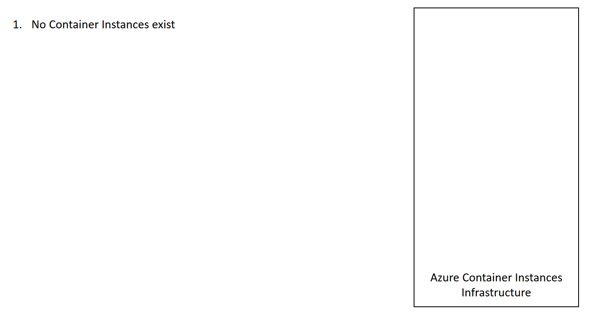
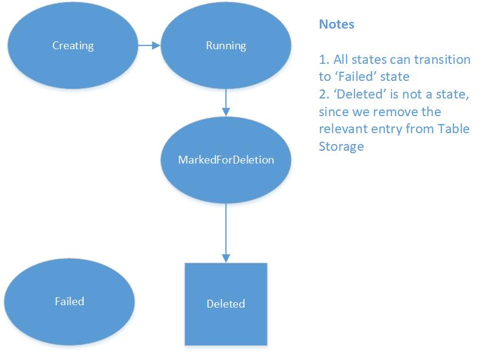

# AzureContainerInstancesManagement

This project allows you to manage Docker containers running on [Azure Container Instances](https://azure.microsoft.com/en-us/services/container-instances/).
Suppose that you want to manage a series of running Docker containers. These containers may be stateful, so classic scaling methods (via Load Balancers etc.) would not work. A classic example is multiplayer game servers, where its server has its own connections to game clients, its own state etc. Another example would be batch-style projects, where each instance would have to deal with a separate set of data. For these kind of purposes, you would need a set of Docker containers being created on demand and deleted when their job is done and they are no longer needed in order to save costs.

## High level overview

Project contains some Functions/webhooks that can be called to create/delete/get logs from Azure Container Instances (called `ACICreate`,`ACIDelete`,`ACIDetails` respectively). There is a Function, called `ACISetSessions`, which can be used to set/report running/active sessions for each container. These sessions could be game server sessions or just 'remaining work to do'. When we create a new container, it takes some time for it to be created. When it's done and the container is running successfully, our project is notified via an [Event Grid](https://azure.microsoft.com/en-us/services/event-grid/) message. This message is posted to the `ACIMonitor` method, whose sole purpose is to listen to this messages and act appropriately. There is also a Function (`ACIList`) that retrieves a list of the running containers, the number of their active jobs/sessions as well as their Public IPs. This can be used to see the load of the running containers.

There is also a Function (`ACISetState`) that enables the caller to set the state of a container. This can be used to 'smoothly delete' a running container. Imagine this, at some point in time, we might want to delete a container (probably the existing ones can handle the incoming load). However, we do not want to disrupt existing jobs/sessions running on this particular container, so we do it call this Function to set its state as 'MarkedForDeletion'. Moreover, there is another Function (`ACIGC`) that is called on regular time intervals whose job is to delete containers that are 'MarkedForDeletion' and have no running jobs/sessions on them. To delete them, it calls the `ACIDelete` Function.

Finally, we suppose that there is an external service that uses our Functions to manage running Docker containers and schedule sessions on them.

## One-click deployment

Click the following button to deploy the project to your Azure subscription:

This operation will trigger a template deployment of the [deploy.json](deploy.json) ARM template file to your Azure subscription, which will create the necessary Azure resources as well as pull the source code from this repository. 

You need to specify the following information in order to deploy the project:
- *Location*: select the Azure Region where your resources will be deployed. [Make sure to select a location that Azure Container Instances are available](https://docs.microsoft.com/en-us/azure/container-instances/container-instances-quotas#region-availability).
- *Function Name*: select a unique name for your Function App. This will determine your Function's DNS, so choose wisely.
- *Repo URL*: this determines the repo that contains the files which will be pulled to create the Azure Functions. You can leave the default or switch it with your own fork.
- *Branch*: this corresponds to your project's GitHub branch

The Functions are deployed on a Free [App Service Plan](https://docs.microsoft.com/lt-lt/azure/azure-functions/functions-scale#app-service-plan), you may need to scale it up for increased performance.

The project uses [Managed Service Identity](https://docs.microsoft.com/en-us/azure/active-directory/managed-service-identity/overview) and its relationship with [Azure Functions](https://docs.microsoft.com/en-us/azure/app-service/app-service-managed-service-identity) to authenticate to the Azure ARM API Management Service in order to create/delete/modify the Azure Container Instances needed. The deployment script automatically creates an app identity for the Function App, however you need to give this identity permissions to the Resource Group that will host your Container Instances. To do that:

- Visit the [Azure Portal](https://portal.azure.com)
- Find the Resource Group(s) that you will create your Container Instances in (this may be the same Resource Group that your Function App is hosted)
- Select "Access Control (IAM)"
- Select "Add", "Contributor" as Role, assign access to "Function App" and then select your Azure Function by modifying the subscription/resource group drop down boxes
- Click "Save", you're done!

Moreover, as soon as the deployment completes, you need to manually add the Event Subscription webhook for the `ACIMonitor` Function using the instructions [here](https://docs.microsoft.com/en-us/azure/azure-functions/functions-bindings-event-grid#create-a-subscription). Just make sure that you select the correct Resource Group to monitor for events (i.e. the Azure Resource Group where your containers will be created). This will make the Event Grid send a message to the `ACIMonitor` Function as soon as there is a resource modification in the specified Resource Group. As soon as this completes, your deployment is ready. Optionally, as soon as you get the URL of the `ACIMonitor` Function, you can use [this](deploy.eventgridsubscription.json) ARM template to deploy the Event Grid subscription. 

When you deploy the Event Grid subscription using the Portal, these are the values you need to fill in:

 - *Name*: select a distinctive name for the Event Grid subscription
 - *Topic Type*: select 'Resource Groups' (or 'Azure subscription' if your ACIs will be deployed in various Resource Groups)
 - *Subscription*: the subscription which you want to monitor for ACI Creation
 - *Resource Group*: select the Resource Group that will contain the ACI you create. Make sure that the *Subscribe to all event types* checkbox is checked
 - *Subscriber type*: Webhook
 - *Subscription Endpoint*: this will contain the trigger URL for your ACIMonitor Function
 - *Prefix filter*: leave it blank
 - *Suffix filter*: also leave it blank

## Demo

We've created a couple of demos so that you can test the project, check the detailed documentation at the [DEMOS.md](DEMOS.md) file.

## Technical details

This project allows you to manage [Azure Container Instances](https://azure.microsoft.com/en-us/services/container-instances/) using [Azure Functions](https://azure.microsoft.com/en-us/services/functions/) and [Event Grid](https://azure.microsoft.com/en-us/services/event-grid/). All operations deal with [Container Groups](https://docs.microsoft.com/en-us/azure/container-instances/container-instances-container-groups), which are the top-level resource in Azure Container Instances. Each Container Group can have X number of containers, a public IP etc. Most Functions are HTTP-triggered unless otherwise noted. Moreover, all HTTP-triggered Functions are protected by ['authorization keys'](https://docs.microsoft.com/en-us/azure/azure-functions/functions-bindings-http-webhook#authorization-keys) apart from the `ACIList` Function, which needs to be anonymous so it can be called by the 'list servers' HTML page. 

- **ACICreate**: Creates a new Azure Container Group. Details (container image, volume mounts, resource group, container and container group names) are passed via the POST request.
- **ACIDelete**: Deletes a Container Group with the specified name at the specified Resource Group (details are again passed in the POST body).
- **ACIDetails**: Gets details or logs (depending on a POST parameter) for a Container Group/Container.
- **ACIGC**: [Timer triggered](https://docs.microsoft.com/en-us/azure/azure-functions/functions-bindings-timer), runs every 5' by default, deletes all Container Groups that have no running sessions (zero) and have explicitly been marked as 'MarkedForDeletion'.
- **ACIList**: Returns the details (Public IP/number of active sessions) of all 'Running' Container Groups
- **ACIMonitor**: [EventGrid triggered](https://docs.microsoft.com/en-us/azure/azure-functions/functions-bindings-event-grid), it responds to Event Grid events which occur when a Container Instance resource is created/deleted/changed/failed in the specified Resource Group. This Resource Group is designated when the Event Grid subscription is created (check the [deploy.eventgridsubscription.json](deploy.eventgridsubscription.json)) file.
- **ACISetSessions**: Sets the number of active/running sessions for each Container Group. Caller can send number of sessions for one or more Container Groups. This way, this method can be called by the external service (it will report active sessions for all containers) or by each container itself (it will report active sessions for itself only).
- **ACISetState**: Sets the state of the specified Container Group. The only allowed options are 'MarkedForDeletion' and 'Failed'.

As mentioned before, the HTTP-triggered Functions are supposed to be called by an external service (for a game, this would potentially be the matchmaking service). The details of all running container groups/instances are saved in an [Azure Table Storage](https://azure.microsoft.com/en-us/services/storage/tables/) table that is created during deployment. For each container, there is a row that holds data regarding its name (specifically, the container group name), the Resource Group it belongs to, its Public IP Address, the Azure datacenter location it was created on, its CPU/RAM resources, its current active sessions and its state.

In this table, Azure Container Groups can hold one of the below states:

- **Creating**: Container group has just been created, necessary resources are provisioned, DOcker image is being pulled
- **Running**: Docker image pulled, public IP (if available) ready, can accept connections/sessions
- **MarkedForDeletion**: We can mark a Container Group as `MarkedForDeletion` so that it will be deleted when a) there are no more active sessions and b) the **ACIGC** Function runs
- **Failed**: When something has gone bad

Moreover, if you navigate to the root of the deployment using a web browser (e.g. visit https://your_function_name.azurewebsites.net) you will see a 'list servers' page that displays details about your running servers (Public IPs, ActiveSessions, datacenter Location etc.). The HTML page exists in the `ACIList` Function and served via a `?html=something` input in the query string. We're using [Azure Functions Proxies](https://docs.microsoft.com/en-us/azure/azure-functions/functions-proxies) to have the root path (/) of the application point to the HTML file using the special query string. Check the `proxies.json` file for details.

## Flow

A typical flow of the project scenario goes like this:

1. External service calls `ACICreate`, so a new Container Group is created and is set to `Creating` state in the table.
2. As soon as the Event Grid notification comes to `ACIMonitor` function, this means that the Container Group is ready. The `ACIMonitor` function inserts its public IP into Table Storage and sets its state to `Running`.
3. External service can call `ACIList` to get info about Container Groups in `Running` state. The service can use this information to determine current system load and schedule new sessions accordingly.
4. Moreover, an operator can calll the `ACIDetails` Function to get logs/debug a running Container or get details about the Container Group.
5. External service or the Docker containers themselves can call `ACISetSessions` to set running sessions count on Table Storage.
6. External Service can call `ACISetState` to set Container Group’s state as `MarkedForDeletion` when the Container Group is no longer needed
7. The time triggered `ACIGC` (GC: Garbage Collector) will delete unwanted Container Groups (i.e. Container Groups that have 0 active/running sesions and are `MarkedForDeletion`). The deletion will happen via the `ACIDelete` Function.

**Important**: We take it for granted that the server application will contain code to get access to its state. This way, if its current state is 'MarkedForDeletion', there will be no other sessions on this server when the current workload will finish (e.g. if we're running a multiplayer game server, players will disconnect and return to the matchmaking lobby after the current game complates). This way, Container Instance can safely be removed by the `ACIGC` Function.

## ACIAutoScaler

You will see that we have an `ACIAutoScaler` Function, disabled by default (value is set in the `ACIAutoScaler\function.json` file). This function attempts to provide an autoscaling mechanism for this project. It consists of a timer triggered one and works according to the simple following logic:
- it checks the `ACIAutoScaler\config.json` file for values regarding if scale in/out is allowed and max sessions per server.
- in order to do 'scale out', sum of current active sessions in all containers must be > 80% (default value) of the max load (which is number of containers * max sessions per container). Then, the `ACICreate` Function is called to add another Container Group.
- in order to do 'scale in', sum of current active sessions in all containers must be < 60% (default value) of the max load. Then, the `ACISetState` Function is called to set the container with the fewest active sessions as `MarkedForDeletion` (we take into account that our app/game is clever enough to not schedule any more sessions on this container).
- There is a number for minimum and maximum instances. Both these as well as the scale in/out thresholds are defined in env variables (explained in the next paragraph)
- There is a 'cooldown' time involved, the application uses it to make sure that scale in/out operations do have sufficient time to take place before the next one. We use a single value in Azure Blob storage to store the date/time the last cooldown operation took place.

For all this to work to work, user (optionally) has to manually fill and/or modify values for the following environment variables:
- `CONTAINER_GROUP_TEMPLATE`: the ARM template for the container group that will be deployed. You can use the contents of [this](/various/defaultContainerGroupTemplate.json) file as a starting point (you can modify this file and use it for the OpenArena demo).
- `AUTOSCALER_MINIMUM_INSTANCES` (default 1): the minimum number of instances that should exist in our deployment
- `AUTOSCALER_MAXIMUM_INSTANCES` (default 10): the maximum number of instances
- `AUTOSCALER_SCALE_OUT_THRESHOLD` (default 0.8): the percentage threshold that, when surpassed, a scale out will happen. For example, if our deployment has 2 servers/instances and each one of them can hold 10 sessions, a scale out operation will take place when there are **17** sessions
- `AUTOSCALER_SCALE_IN_THRESHOLD` (default 0.6): same as before, but this time for scale in
- `AUTOSCALER_COOLDOWN_IN_MINUTES` (default 10): the number of minutes for a 'cooldown', i.e. the time that should pass after a scale in/out operation till the next one

This autoscaling is considered pretty basic but can be used as a starting point for you to create your own algorithm and/or establish your own rules.

## Inspiration
This project was heavily inspired by a similar project that deals with a similar issue but uses Azure VMs called [AzureGameRoomsScaler](https://github.com/PoisonousJohn/AzureGameRoomsScaler).

## FAQ

#### What is this **.deployment** file at the root of the project?
This guides the [Kudu](https://github.com/projectkudu/kudu) engine as to where the source code for the Functions is located, in the GitHub repo. Check [here](https://github.com/projectkudu/kudu/wiki/Customizing-deployments) for details.

#### Why are there 4 ARM templates instead of one?
Indeed, there 4 ARM files on the project. They first three of them are executed in the following order:
- **deploy.json**: The master template that deploys the next two
- **deploy.function.json**: Deploys the Azure Function App that contains the Functions of our project
- **deploy.function.config.json**: As we need to set an environment variable that gets the value of our 'ACISetSessions' Function trigger URL, we need to set up this template that executes *after* the deployment of the Azure Function App has completed.
Whereas the next one is to be executed manually:
- **deploy.eventgridsubscription.json**: This template should be deployed **manually** by the user, when the deployment of the others has completed. Reason for this is that in order for this deployment to work, you need the Function App name plus the URL of the ACIMonitor Function, which you can easily get via the Function's UI on the Azure Portal.

#### I want to handle more events from Azure Event Grid. Where is the definition of those events?
Check [here](https://docs.microsoft.com/en-us/azure/event-grid/event-schema-resource-groups) for resource group events and [here](https://docs.microsoft.com/en-us/azure/event-grid/event-schema-subscriptions) for subscription-wide events.

#### How can I troubleshoot my Azure Container Instances?
As always, Azure documentation is your friend, check [here](https://docs.microsoft.com/en-us/azure/container-instances/container-instances-troubleshooting). Don't forget that for running containers, you can see their logs via a call to the `ACIDetails` method.

#### How can I manage Keys for my Functions?
Check [here](https://github.com/Azure/azure-functions-host/wiki/Key-management-API) to read some details about Azure Function's key management API. You can easily retrieve them from the Azure Portal by visiting each Function's page.

#### How can I test the Functions?
Not proper Function testing on this project (yet), however you can see a 'testing' file on `tests\index.js`. To run it, you need to setup an `tests\.env` file with the following variables properly set:

- SUBSCRIPTIONID = ''
- CLIENTID = ''
- CLIENTSECRET = ''
- TENANT = ''
- AZURE_STORAGE_ACCOUNT = ''
- AZURE_STORAGE_ACCESS_KEY = ''

#### How can I monitor Event Grid message delivery?
Check [this page](https://docs.microsoft.com/en-us/azure/event-grid/monitor-event-delivery) on Azure Event Grid documentation.

#### What's the exat format of the container groups ARM Template (or, what kind of JSON can I send to ACICreate)?
Check [here](https://docs.microsoft.com/en-us/azure/templates/microsoft.containerinstance/containergroups) for the ARM Template for Container Groups.

#### I need to modify the ARM templates you provide, where can I find more information?
You can check the Azure Resource Manager documentation [here](https://docs.microsoft.com/en-us/azure/azure-resource-manager/resource-group-overview).

#### In your demos you are using Docker Hub, what if I want to use a private registry?
Check [here](https://docs.microsoft.com/en-us/azure/container-instances/container-instances-using-azure-container-registry) for instructions on how to deploy images that are hosted on Azure Container Registry.

#### Can I modify my container's restart policy?
Of course, check [here](https://docs.microsoft.com/en-us/azure/container-instances/container-instances-restart-policy#container-restart-policy) for the allowed options as well as [here](https://docs.microsoft.com/en-us/azure/templates/microsoft.containerinstance/containergroups) for the correct `restartPolicy` property location on the Container Group ARM template.

#### I want to use this for my app/game. What is the best way to use it? || I want to modify the AutoScaler, how can I do it?
For both purposes, the best way to do it would be to fork the project on GitHub and work on it on your own repo/copy. Then, you could easily modify it and either [manually](https://docs.microsoft.com/en-us/azure/azure-functions/deployment-zip-push) deploy it or (even better) use [Continuous deployment](https://docs.microsoft.com/en-us/azure/azure-functions/functions-continuous-deployment) for Azure Functions.

#### How can I debug my running containers?
Check [here](https://docs.microsoft.com/en-us/cli/azure/container?view=azure-cli-latest#az-container-exec) on how to execute a command from within a running container of a container group. Moreover, you can use Azure Monitor to check for additional runtime metrics, check [here](https://azure.microsoft.com/en-gb/blog/azure-monitor-general-availability-of-multi-dimensional-metrics-apis/) for more details.

## Presentations
- This project was presented at Microsoft Build 2018 conference on May 2018: 
- Also check [Brian Peek's](https://github.com/BrianPeek/) presentation about this project at Game Developers Conference 2018:

- Featured on Azure Container Instances announcement blog post, check the video on https://azure.microsoft.com/en-us/blog/azure-container-instances-now-generally-available/
- Also featured on Azure Friday: https://channel9.msdn.com/Shows/Azure-Friday/Azure-Container-Instances-GA-A-new-compute-primitive 

## Thanks
- To [Brian Peek](https://github.com/BrianPeek/) for testing, feedback and all the great discussions concerning this project.
